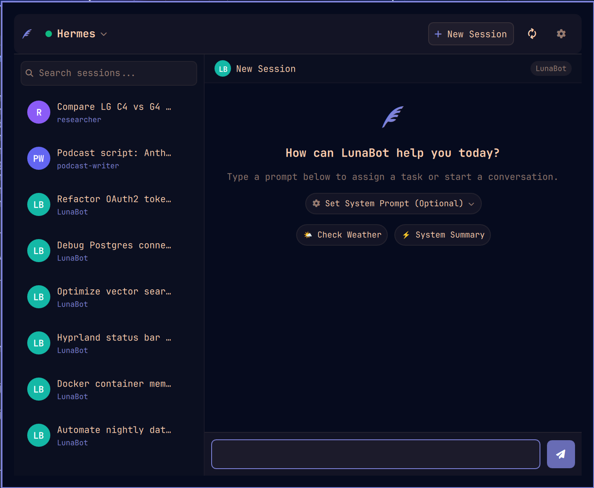

# Omarchy Hermes API Plugin

A native [Omarchy](https://github.com/omarchy) menu bar plugin and flyout interface for interacting with [Hermes Agent](https://github.com/NousResearch/Hermes-Function-Calling) sessions via the Hermes API server.

Built with [Quickshell](https://quickshell.outfoxxed.me/) (QML) and a lightweight Node.js stdio bridge.



---

## 🚀 Quick Start

```bash
# 1. Add the plugin to Omarchy Shell
omarchy plugin add https://github.com/mwhuss/omarchy-hermes-api.git --enable

# 2. Install bridge dependencies
cd ~/.config/omarchy/plugins/com.mwhuss.omarchy-hermes-api && npm ci --omit=dev
```

Configure endpoints and multiplexed agent profiles directly in the flyout settings menu (gear icon ⚙️) or via `~/.config/omarchy-hermes-api/settings.json`.

---

## ✨ Features

- **Status Bar Integration**: Live connection health indicator, activity badge, and one-click flyout popup in your Omarchy bar.
- **Multiplexed Endpoints & Profiles**: Support multiple Hermes server instances and named agent profiles (personas) with per-profile routing, custom monograms, and agent colors.
- **Target Filtering**: Quick dropdown to switch between unified views or filter sessions by specific endpoint and profile.
- **Real-Time Streaming**: Low-latency token-by-token assistant response streaming powered by official OpenAI-compatible SSE endpoints.
- **Rich Tool Execution Cards**: Live collapsible badges tracking agent tool calls (`hermes.tool.progress`), displaying terminal executions, file modifications, web searches, and JSON tool results.
- **Session Management**:
  - Browse, switch, and search conversational sessions.
  - Inline session renaming.
  - Safe two-step session deletion with auto-canceling safety timer.
  - Automatic loading of the most recent active session.
- **Rich Markdown Chat**: Formatted Markdown rendering in assistant responses with clickable links and syntax styling.
- **Custom System Prompts**: Expandable per-session system prompt configuration directly from the empty chat view.
- **Desktop Completion Notifications**: Standard desktop notifications dispatched via `/usr/bin/notify-send` when Hermes finishes a response or encounters an error.
- **In-App Settings UI**: Configure servers, ports, API keys, and multiplexed profiles directly inside the UI without editing files or restarting.

---

## ⚙️ Configuration

Endpoints and agent profiles can be managed directly in the application using the **Settings** menu (gear icon ⚙️ in the upper right corner of the flyout panel).

### Manual JSON Configuration

Settings are stored in an isolated, permission-restricted configuration file at:

```
~/.config/omarchy-hermes-api/settings.json
```

For security, this file is written with strict `0600` permissions (`-rw-------`) so your API keys remain private.

#### Format & Example

```json
{
  "activeTarget": {
    "endpointId": "all",
    "profileName": "all"
  },
  "endpoints": [
    {
      "id": "endpoint-default",
      "name": "Local Hermes",
      "url": "http://127.0.0.1",
      "port": 8642,
      "apiKey": "",
      "profiles": [
        {
          "name": "researcher",
          "apiKey": ""
        },
        {
          "name": "podcast-writer",
          "apiKey": ""
        }
      ]
    },
    {
      "id": "endpoint-cloud",
      "name": "Cloud Gateway",
      "url": "https://hermes.example.com",
      "port": 443,
      "apiKey": "sk-example-token-12345",
      "profiles": []
    }
  ]
}
```

#### Fields

| Field | Description |
|---|---|
| `activeTarget.endpointId` | ID of the active endpoint filter (`"all"` for unified view, or an endpoint ID). |
| `activeTarget.profileName` | Active profile filter name (`"all"`, `""`, or a specific profile name). |
| `endpoints` | Array of Hermes gateway or server instances. |
| `endpoints[].id` | Unique identifier for the endpoint (e.g. `"endpoint-default"`). |
| `endpoints[].name` | Human-readable label displayed in menus, headers, and monograms. |
| `endpoints[].url` | Server hostname and protocol without path (e.g. `http://127.0.0.1` or `https://hermes.example.com`). |
| `endpoints[].port` | Port number integer (1–65535, default: `8642`). |
| `endpoints[].apiKey` | Bearer token authentication key (leave empty for unauthenticated local servers). |
| `endpoints[].profiles` | Array of named multiplexed agent profiles. Each profile object has a `name` and optional per-profile `apiKey`. *(Note: The built-in default profile is automatically provided and does not need to be listed.)* |

### Default Fallback

If `settings.json` does not exist on initial startup, the plugin automatically seeds a default local endpoint pointing to `http://127.0.0.1:8642` and auto-discovers any profiles defined in `~/.hermes/profiles/`.

---

## 🛠️ Manual Installation

1. **Clone the repository:**
   ```bash
   git clone https://github.com/mwhuss/omarchy-hermes-api.git
   cd omarchy-hermes-api
   ```

2. **Install dependencies and register plugin:**
   ```bash
   npm install
   npm run install-plugin
   ```
   *(This installs pinned dependencies and symlinks the plugin to `~/.config/omarchy/plugins/com.mwhuss.omarchy-hermes-api`.)*

3. **Enable the plugin in Omarchy Shell:**
   Add `"com.mwhuss.omarchy-hermes-api"` to your bar layout in `~/.config/omarchy/shell.json`:
   ```json
   {
     "bar": {
       "sections": {
         "right": [
           "com.mwhuss.omarchy-hermes-api",
           "..."
         ]
       }
     }
   }
   ```

4. **Restart Omarchy Shell:**
   Flush the QML component cache and restart the shell:
   ```bash
   omarchy-restart-shell
   ```

---

## 🗑️ Removal

To disable or completely remove the plugin:

```bash
# Temporarily disable the widget
omarchy plugin disable com.mwhuss.omarchy-hermes-api

# Completely remove the plugin and its files
omarchy plugin remove com.mwhuss.omarchy-hermes-api
```

---

## 🧪 Testing

Run the automated bridge integration test suite against your running Hermes API server:

```bash
npm test
```

This verifies:
- Manifest schema validation & default settings
- Server connection & status check (`status`)
- Session listing & normalization (`list-sessions`)
- Session detail & message fetching (`get-session`)
- Inline session renaming (`rename-session`)
- Live NDJSON chat streaming (`stream-chat`)
- Chat streaming with desktop completion notifications (`--notify`)

---

## 🏗️ Architecture

```
┌─────────────────────────────────────────────────────────┐
│                    Omarchy Bar (QML)                    │
│                      (Widget.qml)                       │
└───────────────────────────┬─────────────────────────────┘
                            │
               stdio (NDJSON streaming IPC)
                            │
┌───────────────────────────▼─────────────────────────────┐
│               Node.js Subprocess Bridge                 │
│                 (bin/hermes-bridge.js)                  │
└───────────────────────────┬─────────────────────────────┘
                            │
              REST / OpenAI SSE Protocol
                            │
┌───────────────────────────▼─────────────────────────────┐
│                 Hermes Agent API Server                 │
│                 (http://127.0.0.1:8642)                 │
└─────────────────────────────────────────────────────────┘
```

For detailed architectural decision records, see [`docs/adr/`](docs/adr/).

---

## 🗑️ Removal

To uninstall the plugin using the Omarchy plugin manager:

```bash
omarchy plugin remove com.mwhuss.omarchy-hermes-api
```

### File Lifecycle on Removal

- **Deleted upon removal**:
  - `~/.config/omarchy/plugins/com.mwhuss.omarchy-hermes-api/` (all plugin code, assets, dependencies, and temporary runtime files are removed).
- **Persisting files**:
  - `~/.config/omarchy-hermes-api/settings.json`: The user configuration file (containing configured endpoints, ports, and API keys) is preserved across uninstallations so settings are retained if the plugin is reinstalled or updated. To remove this configuration file manually:
    ```bash
    rm -rf ~/.config/omarchy-hermes-api
    ```
- **Untouched system files**:
  - `~/.hermes/`: Any existing Hermes CLI configuration or profile files are only read if present and are never modified or deleted by this plugin.

---

## 📄 License

[MIT](LICENSE)
