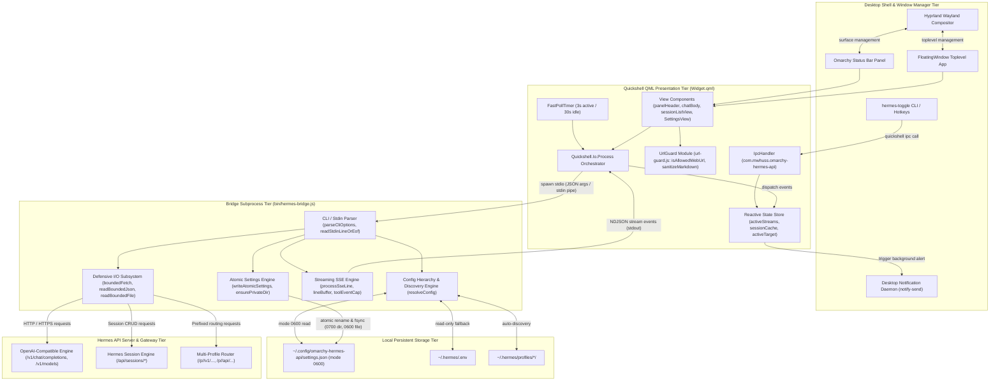
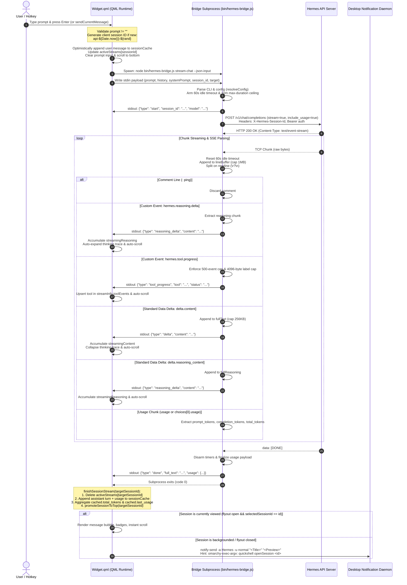
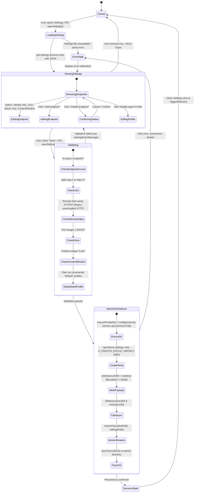
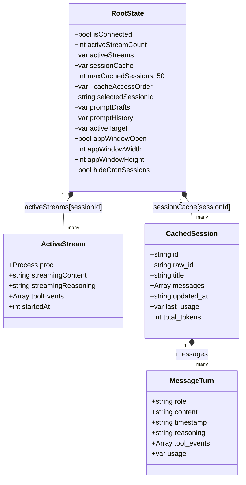
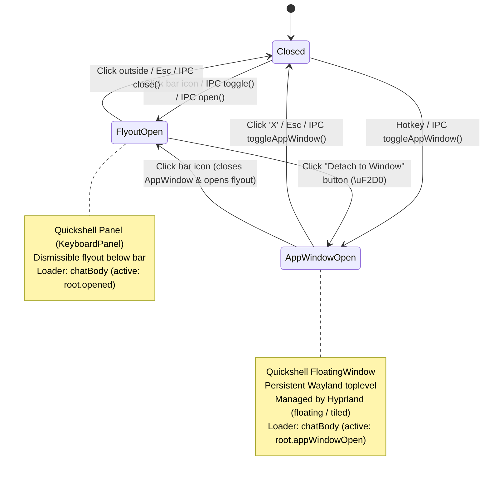

# System Architecture: Omarchy Hermes API Plugin

This document specifies the production system architecture, process boundaries, execution lifecycles, and security invariants of the `omarchy-hermes-api` plugin for the Omarchy Linux desktop shell.

---

## 1. System Overview & Core Principles

The **Omarchy Hermes API Menu Bar Plugin** (`com.mwhuss.omarchy-hermes-api`) is an interactive desktop client for the Hermes Agent API. It provides status bar monitoring, quick-access popouts, standalone desktop application windows, and persistent multi-session conversation management.

```
+---------------------------------------------------------------------------------------+
|                                    Omarchy Desktop                                    |
|  +---------------------------+                     +-------------------------------+  |
|  |  Hyprland Status Bar      |                     |  Floating Window (Wayland)    |  |
|  |  [Icon] [Model] [Tokens]  |                     |  [Standalone Workspace App]   |  |
|  +-------------+-------------+                     +---------------+---------------+  |
|                |                                                   |                  |
|                +-------------------------+-------------------------+                  |
|                                          |                                            |
|                                          v                                            |
|                         +---------------------------------+                           |
|                         |    Quickshell QML Runtime       |                           |
|                         |  (Qt 6, QJSEngine, UrlGuard)    |                           |
|                         +----------------+----------------+                           |
|                                          | stdio (JSON / NDJSON)                      |
|                                          v                                            |
|                         +---------------------------------+                           |
|                         |    Node.js Bridge Subprocess    |                           |
|                         | (Zero npm deps, Native Streams) |                           |
|                         +----------------+----------------+                           |
+------------------------------------------|--------------------------------------------+
                                           | HTTP / HTTPS (SSE)
                                           v
                          +---------------------------------+
                          |    Hermes Agent API Server      |
                          |  (/v1/chat, /api/sessions, ...) |
                          +---------------------------------+
```

### Architectural Principles

1. **Zero Third-Party Runtime Dependencies**: The client requires solely Node.js ($\ge 18.0.0$) and Quickshell. It avoids npm dependencies, bundled binaries, or opaque minified scripts, maximizing audibility and supply-chain safety ([ADR-0009](file:///home/mwhuss/Projects/HermesAPI/omarchy-hermes-api-worktrees/architecture-docs/docs/adr/0009-zero-dependency-native-fetch-bridge.md)).
2. **Strictly Bounded Resource Ceilings**: All remote body consumption, filesystem reads, stream duration timers, tool event accumulations, and line buffers enforce defensive byte and time ceilings against denial-of-service.
3. **Decoupled Process Boundaries**: Quickshell's QJSEngine never performs direct synchronous disk I/O or network socket manipulation. It delegates these operations to short-lived and streaming Node.js subprocesses via standard I/O pipes.
4. **Least-Privilege Secret Storage**: API keys and endpoint profiles are segregated into a dedicated `0600` permission file (`~/.config/omarchy-hermes-api/settings.json`), keeping sensitive credentials isolated from version-controlled desktop dotfiles ([ADR-0007](file:///home/mwhuss/Projects/HermesAPI/omarchy-hermes-api-worktrees/architecture-docs/docs/adr/0007-settings-persistence-and-storage.md)).
5. **Defense-in-Depth UI Sanitization**: Remote markdown, external links, and window events undergo multi-stage sanitization (blocking SSRF, protocol escapes, local image loading, and arbitrary shell execution) before reaching Qt rendering surfaces.

---

## 2. Component and Process Architecture

The system spans five major tiers:

1. **Desktop Shell & Window Manager Tier**: Hyprland, Wayland compositor, status bar panel, and native system notification daemons.
2. **QML Presentation Tier**: Quickshell reactive UI engine running declarative QML, inline JavaScript (QJSEngine), and the `UrlGuard` sanitization module.
3. **Bridge Subprocess Tier**: The Node.js command-line interface script (`bin/hermes-bridge.js`) invoked on demand via `Quickshell.Io.Process`.
4. **Local Persistent Storage Tier**: Isolated settings storage (`~/.config/omarchy-hermes-api/settings.json`) and local Hermes discovery paths (`~/.hermes/.env`, `~/.hermes/profiles/`).
5. **Backend & Transport Tier**: Network communication with Hermes API servers and multi-profile gateway proxies.

### Component Diagram



### Component Roles & Boundaries

| Component | Technology | Lifecycle | Responsibility |
| :--- | :--- | :--- | :--- |
| **`Widget.qml`** | Qt 6 / QML | Persistent daemon loaded in shell bar | Bar icon rendering, window surfaces, in-memory caches, user input handling, process lifecycle management, IPC registration. |
| **`FloatingWindow`** | QtQuick / Quickshell | Owned by `Widget.qml`, shown on demand | Resizable desktop window surface (800×650 default, min 560×480) providing a persistent workspace app. |
| **`UrlGuard`** (`bin/url-guard.js`) | Dual QML/Node.js JS | Loaded by `Widget.qml` & tests | Strict link validation (`http:`, `https:` only) and AST/regex markdown sanitization against SSRF and local image tags. |
| **`Bridge Subprocess`** (`bin/hermes-bridge.js`) | Node.js ($\ge 18$) | Transient subprocess per command | CLI parser, config resolution, network HTTP/SSE communication, atomic settings persistence, defensive size bounding. |
| **`hermes-toggle`** | Bash | Executed on demand by user / hotkey | CLI wrapper sending IPC commands to the running Quickshell desktop shell. |

---

## 3. Streaming Chat Requests & Wire Protocol

The streaming chat lifecycle enables multi-session concurrency, live reasoning extraction, collapsible tool progress badges, token usage accounting, and unviewed background desktop notifications.

### Streaming Wire Protocol Specifications

1. **Client Request**:
   - Dispatched via `stream-chat --json-input` over standard input.
   - Headers:
     - `X-Hermes-Session-Id: <rawSessionId>`: Ensures the server associates generation turns with the target session.
     - `X-Hermes-Source: omarchy-bar`: Identifies desktop bar origin.
     - `Authorization: Bearer <apiKey>`: Passed if configured.
     - `Accept: text/event-stream`.
   - Body: `{"model": "...", "messages": [...], "stream": true, "stream_options": {"include_usage": true}}`.
2. **Server-Sent Events (SSE) Wire Format**:
   - `data: {"choices": [{"delta": {"content": "..."}}]}`: Assistant dialogue deltas.
   - `data: {"choices": [{"delta": {"reasoning_content": "..."}}]}`: Chain-of-thought thinking deltas.
   - `event: hermes.reasoning.delta` with `data: {"text": "..."}`: Vendor reasoning deltas.
   - `event: hermes.tool.progress` with `data: {"tool": "...", "status": "...", "label": "..."}`: Dynamic tool progress updates.
   - `data: {"usage": {"prompt_tokens": N, "completion_tokens": N, "total_tokens": N}}`: Token consumption metric emitted before `[DONE]`.
   - `data: [DONE]`: Stream completion marker.
3. **Bridge-to-QML NDJSON Event Protocol**:
   - `{"type": "start", "session_id": "...", "model": "..."}`: Stream initialization.
   - `{"type": "delta", "session_id": "...", "content": "..."}`: Text token chunk.
   - `{"type": "reasoning_delta", "session_id": "...", "content": "..."}`: Reasoning trace chunk.
   - `{"type": "tool_progress", "session_id": "...", "tool": "...", "status": "...", "label": "..."}`: Tool state update.
   - `{"type": "done", "session_id": "...", "full_text": "...", "full_reasoning": "...", "usage": {...}}`: Turn completion.
   - `{"type": "error", "session_id": "...", "error": "..."}`: Stream failure.

### Complete Streaming Sequence Diagram



---

## 4. Settings State Machine and Persistence Lifecycle

Configuration management operates under strict permission isolation. API tokens and host definitions are stored in `~/.config/omarchy-hermes-api/settings.json` with POSIX permissions `0600` inside a `0700` directory.

### Discovery & Precedence Engine

Connection parameters resolve in strict hierarchical precedence:

```
+-------------------------------------------------------------------------------+
|  1. CLI Flags: -e / --endpoint <id>, -p / --profile <name>                     |
|     +-- Explicit overrides on the bridge invocation                           |
+---------------------------------------+---------------------------------------+
                                        | (if omitted)
                                        v
+-------------------------------------------------------------------------------+
|  2. Environment Variables: HERMES_API_SERVER_URL, HERMES_API_SERVER_KEY, ...   |
|     +-- Shell-level overrides                                                 |
+---------------------------------------+---------------------------------------+
                                        | (if omitted)
                                        v
+-------------------------------------------------------------------------------+
|  3. Endpoint Configuration File: ~/.config/omarchy-hermes-api/settings.json  |
|     +-- Endpoints array, custom profiles, activeTarget, hideCron, appWindow    |
+---------------------------------------+---------------------------------------+
                                        | (if omitted or empty)
                                        v
+-------------------------------------------------------------------------------+
|  4. Local Profile Discovery: ~/.hermes/profiles/<profile>/.env                |
|     +-- Discovered profile API keys                                           |
+---------------------------------------+---------------------------------------+
                                        | (if omitted)
                                        v
+-------------------------------------------------------------------------------+
|  5. Hermes Daemon Environment: ~/.hermes/.env                                 |
|     +-- API_SERVER_URL, API_SERVER_KEY, API_SERVER_PORT                       |
+---------------------------------------+---------------------------------------+
                                        | (if omitted)
                                        v
+-------------------------------------------------------------------------------+
|  6. Built-in Fallback Defaults:                                               |
|     +-- URL: http://127.0.0.1:8642, Name: "Hermes", Profile: "default"        |
+-------------------------------------------------------------------------------+
```

### In-Memory State Machine & Atomic Persistence Flow



### Invariants for Settings Persistence

1. **Ornamental Default Profile Invariant**: Every Hermes Endpoint possesses an inherent default Agent Profile representing the root `hermes-agent`. It is rendered visually in the UI for clarity but is **strictly stripped** before serialization to `settings.json` ([ADR-0008](file:///home/mwhuss/Projects/HermesAPI/omarchy-hermes-api-worktrees/architecture-docs/docs/adr/0008-multiplexed-endpoint-and-profile-routing.md)).
2. **Atomic Replacement Invariant**: Settings are written to `.settings.<random>.tmp` with exclusive flags (`O_CREAT | O_EXCL | O_WRONLY`, mode `0600`), synchronized with `fdatasyncSync`, renamed atomically over the destination path, and the directory entry is synced via `fsyncSync`.
3. **Fail-Closed Mutation Invariant**: Dedicated mutation commands (`set-hide-cron`, `set-app-window-geometry`) verify the integrity of existing settings before updating keys. If the settings file is corrupted, the bridge refuses to overwrite it and returns an explicit error to prevent data loss.

---

## 5. Security and Trust Boundaries

The Omarchy Hermes API plugin operates in a high-privilege environment: a desktop status bar panel running inside the Wayland session with the ability to invoke desktop notifications, execute child processes, and render rich Markdown from remote LLM responses.

### Threat Model & Trust Zones

```mermaid
flowchart LR
    subgraph ZoneUntrusted["Zone 1: Untrusted Remote Input"]
        RemoteLLM["Remote LLM Output (SSE deltas, reasoning, tool output)"]
        HostileEndpoint["Malicious / Compromised Hermes Endpoint"]
        ExternalLinks["Untrusted Hyperlinks & Markdown Images"]
    end

    subgraph ZoneBridge["Zone 2: Bridge Execution Sandbox"]
        SizeBounds["Byte Limits (64KB settings, 32KB text, 1MB json/SSE)"]
        TimeBounds["Time Limits (60s idle, 10m duration, 10s error body)"]
        TransportGuard["Transport Guard: Refuse bearer auth over plain remote HTTP"]
        ToolCapping["Tool Event Caps (500 events max, 4096-byte label cap)"]
        SymlinkRejection["Symlink / FIFO Rejection (O_NOFOLLOW | O_NONBLOCK)"]
    end

    subgraph ZoneQML["Zone 3: Desktop Shell Presentation (Widget.qml)"]
        MarkdownSanitizer["sanitizeMarkdown(): Neutralize image nodes & raw HTML tags"]
        UrlAllowlist["isAllowedWebUrl(): Strict http/https allowlist, drop file/data/qrc"]
        ProcessIsolation["Explicit Arg Arrays (No shell string concatenation)"]
        StdinPipeline["Sensitive Data via Stdin (--json-input, --stdin)"]
    end

    subgraph ZoneHost["Zone 4: Local System & OS Tier"]
        PrivateStorage["~/.config/omarchy-hermes-api/ (mode 0700)"]
        PrivateSettings["settings.json (mode 0600, UID match verification)"]
        WaylandCompositor["Wayland Compositor (Hyprland)"]
    end

    ZoneUntrusted -->|"SSE stream over HTTP/HTTPS"| ZoneBridge
    ZoneBridge -->|"Validated NDJSON over stdio"| ZoneQML
    ZoneQML -->|"Rendered sanitized text & UI"| ZoneHost
    ZoneBridge -->|"Atomic 0600 writes & 0700 dirs"| ZoneHost
```



### Security Defenses & Implementation Details

#### 1. Transport Security & Credential Protection
- **Plain HTTP Remote Authentication Blocking**: If an endpoint specifies a remote hostname (outside loopback `127.0.0.1`, `localhost`, `::1` or private subnets `10.0.0.0/8`, `172.16.0.0/12`, `192.168.0.0/16`, `169.254.0.0/16`, `*.ts.net`, `*.local`), `bin/hermes-bridge.js` **unconditionally refuses** to send Bearer API tokens over unencrypted `http://`. It throws `Insecure transport: refusing to send API credentials over unencrypted HTTP to remote host. Use HTTPS.`
- **Header Injection Sanitization**: All header values (API keys, session IDs) are stripped of carriage returns, newlines, and null bytes (`sanitizeHeaderValue`).

#### 2. Network Denial-of-Service Mitigations
- **Idle Timeout**: Streams abort if no chunk arrives within 60 seconds. Every valid chunk resets the timer.
- **Total Duration Ceiling**: Every stream request enforces an immutable 10-minute maximum duration (`MAX_STREAM_DURATION_MS = 600000`). A slow-drip attacker sending one byte every 59 seconds is aborted when the ceiling fires.
- **Error Response Body Timeout**: Error bodies from non-2xx responses are bounded by a 10-second timeout (`HERMES_ERROR_BODY_TIMEOUT_MS`), preventing endpoints from stalling client cleanup.
- **Body & Buffer Limits**:
  - `readBoundedText`: 32 KB maximum.
  - `readBoundedJson`: 1 MB maximum.
  - `lineBuffer` (SSE line): 1 MB maximum.
  - Tool progress events: Capped at 500 events per stream. Individual tool labels, statuses, and IDs are truncated to 4,096 bytes.

#### 3. Filesystem Hardening & Secret Isolation
- **Symlink & FIFO Defense**: `readBoundedFile` opens files with `O_RDONLY | O_NOFOLLOW | O_NONBLOCK`. If a symlink or named pipe is substituted, the call fails immediately.
- **UID Matching**: If `st.uid !== process.getuid()`, reading is rejected.
- **Permission Enforcement**: File permissions are checked; any mode wider than `0600` is automatically tightened with `fchmodSync(fd, 0o600)`. Directories are enforced to `0700`.

#### 4. UI Trust Boundary & Markdown Sanitization
- **Strict Web Scheme Allowlist (`isAllowedWebUrl`)**:
  - Only `http://` and `https://` schemes are permitted.
  - Schemes like `file:`, `data:`, `qrc:`, `javascript:`, and custom desktop protocols are rejected.
  - URLs cannot exceed 2,048 characters and cannot contain control characters (`\u0000-\u001f`, `\u007f-\u009f`) or userinfo (`@`).
- **Markdown SSRF & Local Asset Protection (`sanitizeMarkdown`)**:
  - Qt Quick's `Text.MarkdownText` parser resolves image URLs automatically, creating SSRF, local file disclosure, and memory exhaustion hazards.
  - `sanitizeMarkdown` strips image tags:
    - Images with valid web URLs become standard clickable text links: `[Image: alt](url)`.
    - Images with dangerous or local URLs (`file:`, `data:`, relative) become inert text labels: `[Image: alt]`.
  - Dangerous HTML blocks (`<script>`, `<style>`, `<svg>`, `<object>`, `<iframe>`, comments, CDATA, DOCTYPE) are stripped.
  - Safe HTML `<a>` tags and `<https://...>` autolinks are converted to Markdown links.
  - Fenced code blocks and inline code spans are extracted into tokenized placeholders prior to filtering and restored verbatim to prevent corrupting legitimate code snippets.

#### 5. Command Execution & Argument Safety
- **No Shell Interpolation**: All subprocess invocations use explicit argument arrays via `Quickshell.Io.Process` rather than invoking shell strings:
  `command: ["/usr/bin/node", "--", root.scriptPath, "stream-chat", "--json-input"]`
- **Argument Delimiter (`--`)**: The `--` token separates Node binary options from script arguments, preventing option injection.
- **Sensitive Data over Stdin**: Settings payloads and chat prompt histories pass through standard input pipes (`--stdin`, `--json-input`) rather than process command-line arguments, preventing credential leakage in `/proc` and `ps` listings.

---

## 6. In-Memory State & Multi-Session Concurrency

`Widget.qml` manages concurrent session streams, prompt drafts, and fast-switching message caches.

### In-Memory State Architecture



### Multi-Session Concurrency Mechanics
1. **Independent Process Allocation**: Each active generation stream allocates its own `streamProcessComponent` instance.
2. **Non-Blocking Session Switching**: If Session A is actively generating, switching to Session B displays Session B's cached history instantly (0ms network delay). Session A continues streaming in the background without UI flicker or indicator leaks ([ADR-0006](file:///home/mwhuss/Projects/HermesAPI/omarchy-hermes-api-worktrees/architecture-docs/docs/adr/0006-multi-session-concurrency-and-session-cache.md)).
3. **Session-Scoped Send/Stop Controls**: The prompt input's Send/Stop button reflects the state of the *currently selected* session:
   - If selected session is in `activeStreams`, the button renders Stop (`\uF04D`) and calls `cancelStreaming()`.
   - If selected session is idle, the button renders Send (`\uF1D8`).
4. **LRU Cache Eviction**: `sessionCache` maintains a maximum of 50 sessions (`maxCachedSessions`). When the cache exceeds capacity, `updateSessionCache` evicts the oldest sessions in `_cacheAccessOrder`, skipping any session currently in `activeStreams`.
5. **Recency Promotion**: When a session receives a user message or completion turn, `promoteSessionToTop()` moves it to the top of `root.sessions` with animated displacement (`ListView.displaced`).

---

## 7. App Window vs. Bar Flyout Lifecycle

The plugin supports two mutually exclusive presentation surfaces ([ADR-0010](file:///home/mwhuss/Projects/HermesAPI/omarchy-hermes-api-worktrees/architecture-docs/docs/adr/0010-bar-widget-owned-floating-window.md)):



- **Shared State**: Both surfaces close over identical `root` state (`activeStreams`, `sessionCache`, `promptDrafts`).
- **Mutual Exclusivity**: Opening the App Window immediately closes the flyout, and vice versa. Loaders ensure only one `chatBody` component is active at any time, preventing duplicate event listeners while preserving background subprocesses.
- **Geometry Persistence**: App Window resizing triggers a debounced timer (350ms) calling `set-app-window-geometry <w> <h>`, clamped to a minimum of 560×480.

---

## 8. Inter-Process Communication (IPC) Reference

The plugin registers the IPC target `com.mwhuss.omarchy-hermes-api` via Quickshell's IPC subsystem, callable via CLI (`quickshell -p /usr/share/omarchy/shell ipc call com.mwhuss.omarchy-hermes-api <method> [args...]`) or `hermes-toggle`.

| Method | Arguments | Returns | Description |
| :--- | :--- | :--- | :--- |
| **`open()`** | None | `void` | Opens the bar flyout panel. |
| **`close()`** | None | `void` | Closes the bar flyout panel. |
| **`toggle()`** | None | `void` | Toggles the bar flyout panel open or closed. |
| **`toggleAppWindow()`** | None | `"ok"` | Toggles the standalone `FloatingWindow` application window. |
| **`newSession()`** | None | `"ok"` | Opens the flyout and initializes a clean, uncommitted session. |
| **`openSession(id)`** | `sessionId: string` | `"ok"` \| error | Opens flyout, selects target session, switches active target if needed, and loads messages. |
| **`syncSession(id)`** | `sessionId: string` | `"ok"` \| error | Signals background turn completion (e.g. from cron or TUI); refreshes sessions and active messages. |
| **`openSettings()`** | None | `"ok"` | Opens the flyout directly into the Settings View. |
| **`closeSettings()`** | None | `"ok"` | Closes the Settings View and returns to conversation view. |
| **`toggleSettings()`** | None | `"ok"` | Toggles the Settings View within the flyout. |
| **`saveSettings()`** | None | `"ok"` \| error | Triggers validation and asynchronous persistence of the settings model. |
| **`addProfile()`** | None | `"ok"` | Opens settings and adds an empty profile to the selected endpoint. |
| **`toggleTargetDropdown()`**| None | `"ok"` | Toggles the endpoint/profile target selector in the header. |
| **`toggleAgentPicker()`** | None | `"ok"` | Toggles the Agent Target picker popup for new sessions. |
| **`testNotify()`** | None | `"ok"` | Dispatches a diagnostic test desktop notification. |

---

## 9. Verification & Automated Testing

The codebase includes an automated hermetic test suite (`test/test-bridge.js`) verifying all bridge protocols, security boundaries, and CLI subcommands using an in-memory mock Hermes API server.

### Test Execution Commands

```bash
# Run hermetic test suite against in-memory mock server
npm test

# Run tests against a live Hermes API daemon (requires HERMES_LIVE=1)
npm run test:live

# Reload the desktop shell to load updated QML components
npm run reload
```

### Verified Test Subsystems
- **CLI Options Parser**: Argument extraction, flags (`-e`, `-p`, `--json-input`, `--stdin`), and `--` separator handling.
- **Zero-Dependency Architecture**: Purity of package configuration and Node version compliance.
- **SSE Parsing & Wire Events**: Comment filtering, chunk fragmentation, OpenAI deltas, vendor `reasoning_content` deltas, `hermes.reasoning.delta`, and `hermes.tool.progress`.
- **Token Usage Metric Extraction**: Capturing and forwarding `usage` objects in `done` event payloads.
- **URL & Markdown Security**: Allowlist filtering across 24 hostile URL cases and 30 hostile Markdown injection cases (SSRF, local file URIs, HTML script tags).
- **Bridge Sandboxing**:
  - Symlink and named pipe rejection in `readBoundedFile`.
  - Directory mode `0700` and file mode `0600` enforcement in `ensurePrivateDir` and `writeAtomicSettings`.
  - Oversized SSE line rejection and memory caps.
  - Stalled and slow-drip error body timeouts.
  - Stream duration ceiling and tool event caps under hostile endpoints.
